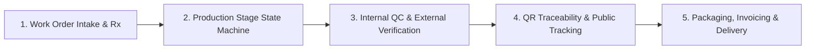
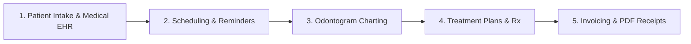

# High-Level System Architecture & Process Flow Design

> **Unified Dental Platform (Dental Clinics & Dental Laboratories SaaS)**
> Comprehensive Architectural Blueprint, Entity Scopes, Module Isolation & Lifecycle Pipelines.

---

## 🏛 1. Global Architectural Overview

Unified Dental is architected as an **enterprise-grade, multi-tenant SaaS application** supporting independent and unified operations for Dental Clinics and Dental Laboratories.

```
┌─────────────────────────────────────────────────────────────────────────────────────────────┐
│                                   GLOBAL PLATFORM ADMIN                                     │
│  - System Super Admin          - Global Module Catalog        - Plan & Capacity Enforcement │
│  - Multi-Tenant Provisioning   - Global Audit Trail           - Global Subscription Engine  │
└──────────────────────────────────────────────┬──────────────────────────────────────────────┘
                                               │ Provisions & Governs
                                               ▼
┌─────────────────────────────────────────────────────────────────────────────────────────────┐
│                           TENANT / ORGANIZATION BOUNDARY                                    │
│   Subdomain Scope: {tenant-slug}.app.example.com  |  Tenant Admin  |  Shared Organization DB│
├─────────────────────────────────────────────────────────────────────────────────────────────┤
│                                  CORE OPERATIONS                                            │
│   • Dashboard (`/`)      • Branch (`/branches`)  • Settings (`/settings`)                   │
│   • Finance (`/finance`) • Remainder (`/reminders`) • Inventory (`/inventory`) • Expense  │
├──────────────────────────────────────────────┬──────────────────────────────────────────────┤
│                                              │                                              │
│                     ▼                        │                       ▼                      │
│   ┌────────────────────────────────────┐     │     ┌────────────────────────────────────┐   │
│   │         DENTAL LAB MODULE          │     │     │        DENTAL CLINIC MODULE        │   │
│   ├────────────────────────────────────┤     │     ├────────────────────────────────────┤   │
│   │ • Lab Branches (Milling, Finishing)│     │     │ • Clinic Branches (Main, Outpost)  │   │
│   │ • Scoped Roles:                    │     │     │ • Scoped Roles:                    │   │
│   │   - Lab Manager                    │     │     │   - Clinic Admin                   │   │
│   │   - Master Technician              │     │     │   - Dentist / Doctor               │   │
│   │   - Lab Technician                 │     │     │   - Dental Assistant               │   │
│   │   - QC Inspector (Verification)    │     │     │   - Receptionist / Front Desk      │   │
│   │   - Delivery Courier               │     │     │   - Billing Specialist             │   │
│   │ • Menus:                           │     │     │ • Menus:                           │   │
│   │   - Users (Admin, Tech, Doctors)   │     │     │   - Users (Admin, Staff, Doctors)  │   │
│   │   - Work Orders (`/lab/work-orders`)│    │     │   - Patient (`/clinic/patients`)   │   │
│   │   - Prosthesis type (`/lab/prosthesis`)  │     │   - Appointment (`/clinic/appts`)  │   │
│   │   - Process (`/lab/processes`)     │     │     │   - Income (`/clinic/income`)      │   │
│   │   - Process Areas (`/lab/areas`)   │     │     └────────────────────────────────────┘   │
│   │   - Whatsapp Template (`/lab/wa`)  │                                                    │
│   └─────────────────┬──────────────────┘                                                    │
│                     │                                                                       │
│                     └───────────────► ⟷ CROSS-MODULE BRIDGE ⟷ ◄────────────────────────────┘
│                                       (Clinic → Lab Orders, Shared Patients,
│                                        Live QC Status, Unified Invoicing)
└─────────────────────────────────────────────────────────────────────────────────────────────┘
```

---

## 🎨 2. Visual Architecture & Process Diagrams

Interactive and vector diagrams are located in the repository for visual reference:

| Asset | Format | Description | Path |
|---|---|---|---|
| **Interactive Process Flow** | HTML + Modern Theme | High-resolution interactive visual diagram with dark/light mode and grid patterns | [process-flow-diagram.html](file:///d:/Projects/unified_dental/docs/process-flow-diagram.html) |
| **Vector Architecture Map** | Standalone SVG | Scalable vector graphic diagram detailing scopes, branches, roles, and pipelines | [process-flow-diagram.svg](file:///d:/Projects/unified_dental/docs/process-flow-diagram.svg) |

---

## 🏢 3. Multi-Tenant Hierarchy & Boundary Enforcement

The platform strictly isolates data and operations at 4 hierarchical levels:

### Level 1: Global Platform Scope (`Super Admin`)
- **Access**: Root domain (e.g. `app.example.com` without tenant context).
- **Capabilities**:
  - Provision and configure tenant organizations (`/tenants`).
  - Configure dynamic system modules (`/modules`).
  - Manage tiered subscription plans and pricing boundaries (`/plans`).
  - System-wide audit logs and health monitoring.

### Level 2: Tenant Organization Scope (`Tenant Admin / Owner`)
- **Access**: Unique tenant subdomain (`{tenant-slug}.app.example.com`).
- **Capabilities**:
  - Full governance over all subscribed modules (Lab-only, Clinic-only, or Combined Clinic+Lab).
  - Organization branding, custom logo, timezone, currency, and date formatting (`/settings`).
  - Organization-wide branch management (`/branches`).
  - Core administrative operations (`Finance`, `Remainder`, `Inventory`, `Expense`).

### Level 3: Branch Scoping
- Every branch belongs strictly to a `tenant_id`.
- Branches represent physical facilities (e.g. *Central Milling Lab*, *Regional Finishing Branch*, *Main Dental Practice*, *Satellite Outpost Clinic*).
- Users and resources can be scoped to specific branches or granted organization-wide access.

### Level 4: Granular RBAC & Role Scoping
- **Role Isolation**: A user assigned to a Lab role (e.g. `Lab Technician`) cannot access Clinic patient EHR records, and vice versa.
- **Permission Checks**: Backend endpoints enforce permission attributes (e.g. `can('work_order.create')`, `can('patient.view')`) rather than hardcoded string roles.

---

## ⚙️ 4. Navigation & Single-Expand Accordion Architecture

The sidebar navigation implements a **Single-Expand Accordion with Tree-Line Hierarchy**:

```
[Sidebar Top: Organization Brand & Collapsed Toggle]
 │
 ├── [Accordion 1: Core Operations ⌄]  (Active on Dashboard & Core Routes)
 │    ├── Dashboard (`/`)
 │    ├── Branch (`/branches`)
 │    ├── Settings (`/settings`)
 │    ├── Finance (`/finance`)
 │    ├── Remainder (`/reminders`)
 │    ├── Inventory (`/inventory`)
 │    └── Expense (`/expenses`)
 │
 ├── [Accordion 2: Dental Lab ⌄]  (Visible & Active in Lab Mode)
 │    ├── Users ⌄  (Level 1 Sub-menu)
 │    │    ├── Lab Admin (`/lab/users/admin`)       (Level 2 Tree-Line Indented)
 │    │    ├── Technician (`/lab/users/technicians`) (Level 2 Tree-Line Indented)
 │    │    └── Doctors (`/lab/users/doctors`)       (Level 2 Tree-Line Indented)
 │    ├── Work Orders (`/lab/work-orders`)
 │    ├── Prosthesis type (`/lab/prosthesis-types`)
 │    ├── Process (`/lab/processes`)
 │    ├── Process Areas (`/lab/process-areas`)
 │    └── Whatsapp Template (`/lab/whatsapp-templates`)
 │
 └── [Accordion 3: Dental Clinic ⌄]  (Visible & Active in Clinic Mode)
      ├── Users ⌄  (Level 1 Sub-menu)
      │    ├── Admin (`/clinic/users/admin`)        (Level 2 Tree-Line Indented)
      │    ├── Staff (`/clinic/users/staff`)        (Level 2 Tree-Line Indented)
      │    └── Doctors (`/clinic/users/doctors`)    (Level 2 Tree-Line Indented)
      ├── Patient (`/clinic/patients`)
      ├── Appointment (`/clinic/appointments`)
      └── Income (`/clinic/income`)
```

### Key Interaction Rules:
1. **Active Route Binding**: The parent accordion group of whichever route is currently selected is automatically expanded (e.g. `/` expands `Core Operations`; `/lab/work-orders` expands `Dental Lab`).
2. **Mutual Exclusivity**: Expanding one accordion group automatically collapses all other groups.
3. **Module Mode Strict Isolation**: Switching between Clinic and Lab in the header switcher displays **only** the corresponding module's menu group alongside Core Operations.

---

## 🔄 5. Operational Lifecycle Pipelines

### 5.1 Dental Lab Production Pipeline



1. **Work Order Intake & Rx Specs**:
   - Prescription details, dental shade matching, tooth matrix selection, material choices, and target due dates.
2. **Production Stage State Machine**:
   - Sequential production stages: `CAD/CAM Scanning` → `3D Milling / Casting` → `Ceramic Layering` → `Glazing & Polishing`.
3. **Internal QC & External Verification**:
   - Internal checkpoint sign-offs.
   - Automated email alerts to external dentists for try-in verification and fitment approval.
4. **QR Code Traceability & Public Tracking**:
   - Unique QR code generated per work order for instant mobile scanning across workstations and public patient tracking.
5. **Packaging, Invoicing & Delivery**:
   - Courier dispatch voucher creation, shipping verification, and lab service fee billing.

---

### 5.2 Dental Clinic Practice Pipeline



1. **Patient Intake & Medical History**:
   - Demographics, medical alerts, allergy records, dental insurance, and emergency contacts.
2. **Appointment Scheduling & Automated Reminders**:
   - Multi-doctor chair scheduling, calendar views, and automated SMS/Email appointment confirmations.
3. **Interactive Odontogram Charting**:
   - Visual 2D tooth condition mapping, periodontal probing pocket depth tracking, and history logs.
4. **Treatment Plans & Prescriptions**:
   - Multi-phase procedure sequencing, e-prescriptions with digital dosage schedules, and direct lab work dispatch.
5. **Billing, Invoices & PDF Receipts**:
   - Itemized procedure billing, copayments, payment installments, and automated PDF receipt generation.

---

## 🔗 6. Cross-Module Integration Bridge (Phase 4)

When a tenant operates in **Combined Clinic + Lab Mode**:
- **Direct Order Dispatch**: A clinic doctor creates a lab order directly from the patient's dental chart without manual re-entry.
- **Real-Time Synchronization**: Status transitions inside the Lab module (e.g. *In Milling*, *Ready for Try-in*, *Delivered*) reflect live on the patient's timeline in the Clinic module.
- **Architectural Loose Coupling**: Communication between modules occurs strictly via **Application Contracts** and **Domain Events** (Redis/BullMQ) with zero database-level foreign key locks between sibling module schemas.

---

## 🌐 7. Infrastructure, Timezone & Regional Localization Standards

- **Node.js Process UTC Normalization**: The backend process enforces `process.env.TZ = 'UTC'`.
- **Tenant Business Timezone Handling**: All date comparisons and scheduler triggers use `timezone.util.ts` evaluated in `tenant.settings.timezone` (defaulting to `America/Mexico_City`).
- **Calendar Date Normalization**: Date-only calendar values (delivery dates, appointment dates, birth dates) are stored at UTC noon (`12:00:00.000Z`) via `parseCalendarDate()` to prevent the Western Hemisphere `-1 day` offset.
- **Bilingual i18n Engine**: 100% synchronized English (`en`) and Spanish (`es`) translation trees across all frontend components and backend transactional templates.
- **Theme Engine**: Semantic CSS tokens supporting persistent Dark and Light themes with WCAG-compliant contrast.
